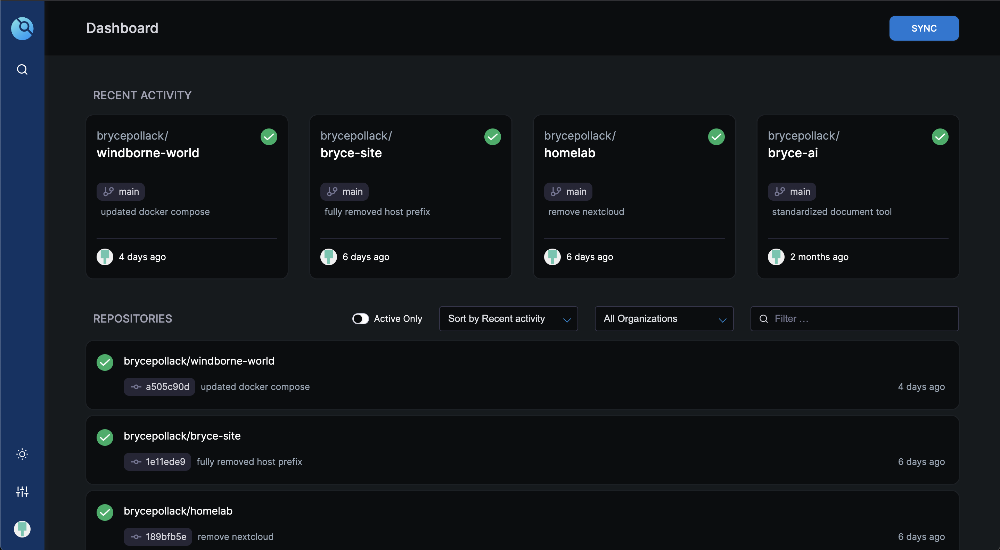

As the variety of software I use in my day-to-day life increases, being able to know how and where these tools work has become more and more interesting to me. What better way to understand the software you use than to host the software yourself?

# Introduction

Self-hosting is exactly what it sounds like: running apps and services on your own computer and managing everything yourself, from hardware to networking. This is instead of relying on providers like Google or Microsoft to host these apps and services using their infrastructure. The main advantage of self-hosting is control over your data (though of course there are exceptions).

The biggest draw for me, however, is the learning opportunity. I love digging into how things work under the hood, and applying that curiosity to tools I use every day—like replacing Google Docs with an open source alternative—is an easy way for me to grow as a developer/computer scientist outside of grinding LeetCode or forcing myself to build portfolio projects I’m not actually interested in.

# The Machine

First things first: all computer programs need a computer to run on. I happened to have a [Raspberry Pi 4B](https://www.raspberrypi.com/products/raspberry-pi-4-model-b/) that used to host a Minecraft server laying around, so that's what I'll be using here. After wrapping it up in the [cheapest piece of aluminum I could buy off Amazon](https://www.amazon.com/dp/B07ZVJDRF3?ref=ppx_yo2ov_dt_b_fed_asin_title&th=1) and flashing it with [Raspberry Pi OS](https://www.raspberrypi.com/software/operating-systems/), it was ready to be transformed into a tiny home server/space heater.

I didn't feel like shelling out the big bucks for a micro HDMI adapter (the least niche display port on the Raspberry Pi 4B), so I chose to run my Pi headless. This means I'll be using my Pi without a monitor or keyboard connected. My Raspberry Pi OS image came with SSH pre-configured, so I can easily access and control the Pi directly from my laptop over Wi-Fi by running the following from my laptop:

<div style="background-color:#1e1e1e; color:#d4d4d4; padding:1em; border-radius:6px; font-family: 'Fira Mono', monospace; font-size:14px; line-height:1.4em; overflow-x:auto;">
<b>bryce@bryce-macbook ~ %</b> ssh admin@192.168.1.100<br>
Linux pi 6.6.51+rpt-rpi-v8 #1 SMP PREEMPT Debian 1:6.6.51-1+rpt3 (2024-10-08) aarch64<br>
Last login: Thu Sep 18 23:09:51 2025 from 100.114.191.30<br>
<b>admin@pi:~ $</b>
</div>

_hacker voice_ I'm in.

# IaC

Right now, I have to `ssh` in, run some commands, and then decipher the not-so-human-friendly output whenever I want to make changes to my Pi or view any of my system settings. I would like all of my important configuration in a single place, written in a way that’s easy to understand, repeat, and reuse in case something happens to my Pi or I want to add new hardware to my homelab.

That's where infrastructure-as-code comes in. [Ansible](https://docs.ansible.com/) is a framework/automation tool that lets you describe how your systems should be configured using YAML files (your infrastructure-as-code), then apply that configuration with a single command. I'll be using Ansible to write my IaC.

Ansible needs to know which machines it’s managing and how to connect to them. That’s what the `inventory.ini` file is for:

```
[pi]
192.168.1.100 ansible_user=ansible ansible_ssh_private_key_file=/Users/bryce/.ssh/rsa

[all:vars]
...
```

Playbooks are how Ansible groups and defines the instructions you want to run on your machines. Here’s an example playbook `setup.yml` I use for setting up essential packages on my Pi:

```
- name: Initial setup
  hosts: pi
  become: yes
  tasks:
    - name: Update apt cache
      apt:
        update_cache: yes
        cache_valid_time: 3600

    - name: Upgrade all packages
      apt:
        upgrade: dist

    - name: Install essential packages
      apt:
        name:
          - apt-transport-https
          - ca-certificates
          - curl
          - gnupg
          - git
          - ufw
          - jq
          - vim
          - rsync
          - nginx
          - cron
        state: present
```

I then use a single entrypoint file `main.yml` to pull all my different playbooks together:

```
- name: Setup Raspberry Pi Homelab
  hosts: pi
  become: yes
  gather_facts: yes

  tasks:
    - import_playbook: playbooks/setup.yml
    - import_playbook: playbooks/docker.yml
    - import_playbook: playbooks/tailscale.yml
    ...
```

Finally, to deploy my infrastructure I run:

```
ansible-playbook -i inventory.ini main.yml --diff
```

# CI/CD

CI/CD (Continuous Integration and Continuous Deployment) is a way to automate testing and deployment of software so that every change can quickly and safely go live without the manual effort of moving source code over via FTP or `scp`, running a bunch of commands to get the service back up and running, and then checking if there were any build errors in the process. Instead, all these steps will be defined as code (much like in the last section)!

I chose [Drone CI](https://www.drone.io/) since it's the open source version of Harness, the platform I use for CI/CD at my day job.

Drone runs as two separate services: the server, which provides the web interface and API backend, and the runner, the worker that actually executes the jobs defined in the CI/CD pipelines.

Here's the simple `docker-compose.yml` I use to orchestrate my Drone containers:

```
services:
  drone:
    image: drone/drone:2
    container_name: drone
    restart: always
    ports:
      - "8080:80"
    volumes:
      - /services/drone/data:/data
    environment:
      - DRONE_SERVER_HOST=
      - DRONE_SERVER_PROTO=
    networks:
      - drone-net

  drone-runner:
    image: drone/drone-runner-docker:1
    container_name: drone-runner
    restart: always
    depends_on:
      - drone
    volumes:
      - /var/run/docker.sock:/var/run/docker.sock
    environment:
      - DRONE_RPC_HOST=
      - DRONE_RPC_PROTO=
      - DRONE_RUNNER_CAPACITY=
      - DRONE_RUNNER_NAME=
    networks:
      - drone-net

networks:
  drone-net:
    external: true
```

Drone's web interface uses GitHub to authenticate users and hook into available repositories. After signing in with my GitHub credentials and going to http://192.168.1.100:8080 I can see:



For any projects I want to build/deploy on my Pi, all I have to do is add a `.drone.yml` file with the build steps. Then, source code on my laptop can be seamlessly transformed into an actual program running on my Pi just by pushing it to GitHub!

# Nginx

At long last, my Pi is ready to reveal itself to the outside world.

I want people outside of my home network to be able to open up a browser, go to https://brycepo.com, and get served content by my Pi. If you are reading this, that means it's working!

Nginx is probably the most popular choice for a web server and the one that I'm most familiar with. It’s configured using server blocks, which are like individual rules for handling requests to different domains or services. Each server block defines things like the domain name, which port to listen on, where to find the files to serve, and how to handle SSL or redirects:

```
server {
    listen 80;
    server_name brycepo.com;
    return 301 https://$host$request_uri;
}

server {
    listen 443 ssl;
    server_name brycepo.com;

    ssl_certificate /path/to/fullchain.pem;
    ssl_certificate_key /path/to/privkey.pem;
    include /path/to/options-ssl-nginx.conf;
    ssl_dhparam /path/to/ssl-dhparams.pem;

    root /var/www/html;
    index index.html index.htm;

    location / {
        try_files $uri $uri/ =404;
    }
}
```

Now when someone visits https://brycepo.com, their browser first asks a DNS resolver for the IP address of the domain. Because I’m using Cloudflare as my DNS provider, Cloudflare’s servers respond with the public IP address of my Pi. The request then reaches my Pi, where Nginx receives it, determines which service should handle it, and returns the response to the user’s browser (in this case, an HTML document which the browser can render into my glorious homepage).

Thank you for taking the time to read this! I've left out a lot (and maybe included a lot I should have left out) with regards to what services I'm actually using my homelab for, so I'll try to create a writeup of those next.
